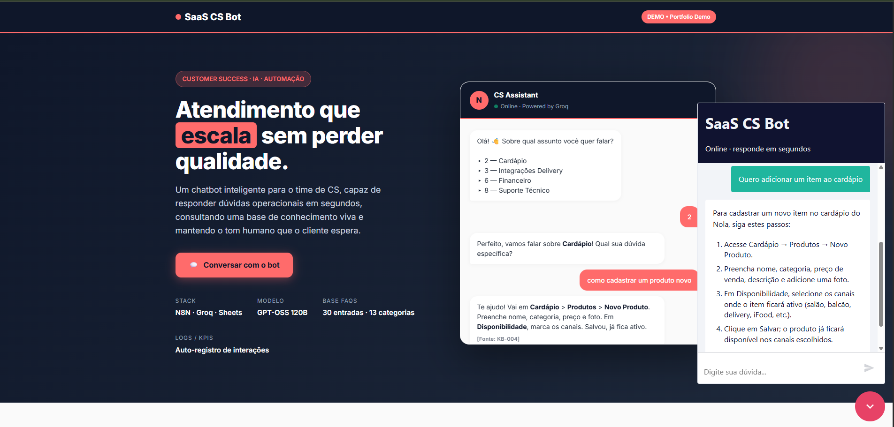
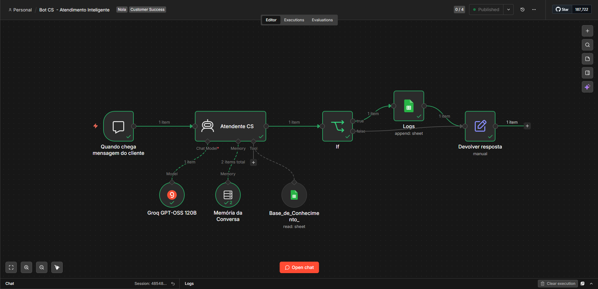

# SaaS CS Bot

> Customer Success chatbot for SaaS platforms — automated support, onboarding guidance and FAQ handling powered by AI.

**Live demo:** [nolabot.netlify.app](https://nolabot.netlify.app)

---

## Screenshots

### Interface


### Workflow (n8n)


---

## What it does

This bot handles the first line of customer success interactions for SaaS platforms, reducing manual support load and improving response time. It answers product questions, guides users through onboarding steps, and escalates complex issues to the human CS team.

**Key capabilities:**
- Answers common product questions instantly
- Guides new users through onboarding flows
- Collects and logs user feedback to Google Sheets
- Escalates unresolved issues with full conversation context
- Available 24/7 without human intervention

---

## Stack

| Layer | Technology |
|-------|-----------|
| Automation | n8n (self-hosted workflow engine) |
| AI Model | Groq LLM (Llama 3) |
| Data Layer | Google Sheets API |
| Frontend | Netlify (static deployment) |

---

## Architecture

```
User message
    ↓
n8n webhook trigger
    ↓
Groq LLM (context + prompt)
    ↓
Response generation
    ↓
Google Sheets logging
    ↓
User reply
```

---

## Why this project

Built to solve a real problem: SaaS companies with small CS teams spend too much time answering the same questions. This bot handles the repetitive layer so the CS team can focus on retention, upsell, and complex issues.

---

## Author

**Matheus Venceslao de Mattos**
Customer Success | CPA-ANBIMA | AI Automation

[LinkedIn](https://linkedin.com/in/matheus-v-mattos) · [GitHub](https://github.com/matheus-vmattos)
